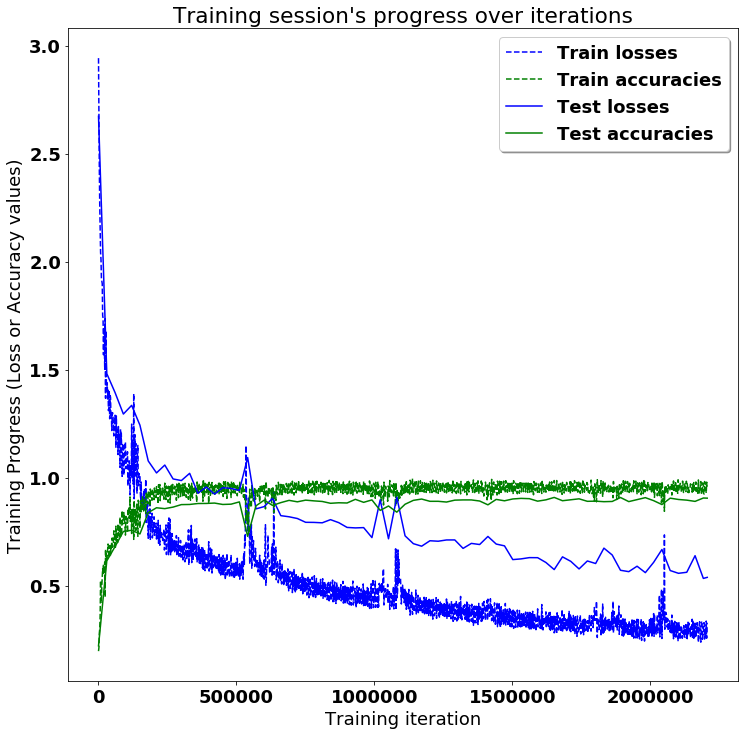
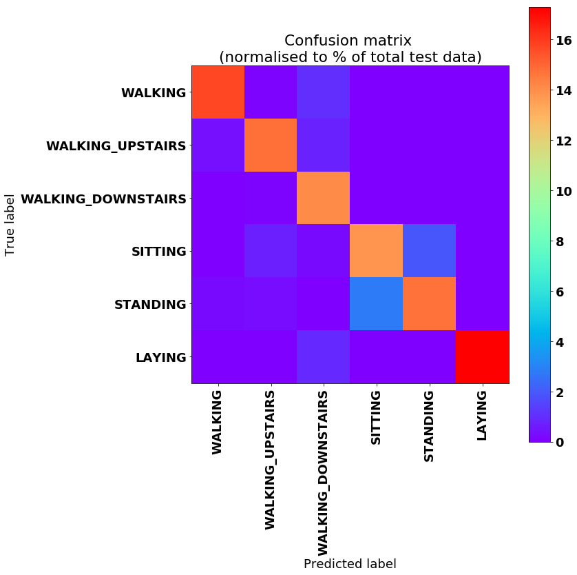

# <a title="Activity Recognition" href="https://github.com/guillaume-chevalier/LSTM-Human-Activity-Recognition" > LSTMs for Human Activity Recognition</a>

Human Activity Recognition (HAR) using smartphones dataset and an LSTM RNN. Classifying the type of movement amongst six categories:
- WALKING,
- WALKING_UPSTAIRS,
- WALKING_DOWNSTAIRS,
- SITTING,
- STANDING,
- LAYING.

Compared to a classical approach, using a Recurrent Neural Networks (RNN) with Long Short-Term Memory cells (LSTMs) require no or almost no feature engineering. Data can be fed directly into the neural network who acts like a black box, modeling the problem correctly. [Other research](https://archive.ics.uci.edu/ml/machine-learning-databases/00240/UCI%20HAR%20Dataset.names) on the activity recognition dataset can use a big amount of feature engineering, which is rather a signal processing approach combined with classical data science techniques. The approach here is rather very simple in terms of how much was the data preprocessed. 

Let's use Google's neat Deep Learning library, TensorFlow, demonstrating the usage of an LSTM, a type of Artificial Neural Network that can process sequential data / time series. 

## Video dataset overview

Follow this link to see a video of the 6 activities recorded in the experiment with one of the participants:

<p align="center">
  <a href="http://www.youtube.com/watch?feature=player_embedded&v=XOEN9W05_4A
" target="_blank"></a>
  <a href="https://youtu.be/XOEN9W05_4A"><center>[Watch video]</center></a>
</p>

## Details about the input data

I will be using an LSTM on the data to learn (as a cellphone attached on the waist) to recognise the type of activity that the user is doing. The dataset's description goes like this:

> The sensor signals (accelerometer and gyroscope) were pre-processed by applying noise filters and then sampled in fixed-width sliding windows of 2.56 sec and 50% overlap (128 readings/window). The sensor acceleration signal, which has gravitational and body motion components, was separated using a Butterworth low-pass filter into body acceleration and gravity. The gravitational force is assumed to have only low frequency components, therefore a filter with 0.3 Hz cutoff frequency was used. 

That said, I will use the almost raw data: only the gravity effect has been filtered out of the accelerometer  as a preprocessing step for another 3D feature as an input to help learning. If you'd ever want to extract the gravity by yourself, you could fork my code on using a [Butterworth Low-Pass Filter (LPF) in Python](https://github.com/guillaume-chevalier/filtering-stft-and-laplace-transform) and edit it to have the right cutoff frequency of 0.3 Hz which is a good frequency for activity recognition from body sensors.

## What is an RNN?

As explained in [this article](http://karpathy.github.io/2015/05/21/rnn-effectiveness/), an RNN takes many input vectors to process them and output other vectors. It can be roughly pictured like in the image below, imagining each rectangle has a vectorial depth and other special hidden quirks in the image below. **In our case, the "many to one" architecture is used**: we accept time series of [feature vectors](https://www.quora.com/What-do-samples-features-time-steps-mean-in-LSTM/answer/Guillaume-Chevalier-2) (one vector per [time step](https://www.quora.com/What-do-samples-features-time-steps-mean-in-LSTM/answer/Guillaume-Chevalier-2)) to convert them to a probability vector at the output for classification. Note that a "one to one" architecture would be a standard feedforward neural network. 

> <a href="http://karpathy.github.io/2015/05/21/rnn-effectiveness/" ></a>
> http://karpathy.github.io/2015/05/21/rnn-effectiveness/

## What is an LSTM?

An LSTM is an improved RNN. It is more complex, but easier to train, avoiding what is called the vanishing gradient problem. I recommend [this article](http://colah.github.io/posts/2015-08-Understanding-LSTMs/) for you to learn more on LSTMs.


## Results 

Scroll on! Nice visuals awaits. 


```python
# All Includes

import numpy as np
import matplotlib
import matplotlib.pyplot as plt
import tensorflow as tf  # Version 1.0.0 (some previous versions are used in past commits)
from sklearn import metrics

from tensorflow.python.framework.graph_util import remove_training_nodes
from tensorflow.python.framework import graph_util as gu

import os
```


```python
# Useful Constants

# Those are separate normalised input features for the neural network
INPUT_SIGNAL_TYPES = [
    "body_acc_x_",
    "body_acc_y_",
    "body_acc_z_",
    "body_gyro_x_",
    "body_gyro_y_",
    "body_gyro_z_",
    "total_acc_x_",
    "total_acc_y_",
    "total_acc_z_"
]

# Output classes to learn how to classify
LABELS = [
    "WALKING", 
    "WALKING_UPSTAIRS", 
    "WALKING_DOWNSTAIRS", 
    "SITTING", 
    "STANDING", 
    "LAYING"
] 

```

## Let's start by downloading the data: 


```python
# Note: Linux bash commands start with a "!" inside those "ipython notebook" cells

DATA_PATH = "data/"

#!pwd && ls
os.chdir(DATA_PATH)
#!pwd && ls

!python download_dataset.py

#!pwd && ls
os.chdir("..")
#!pwd && ls

DATASET_PATH = DATA_PATH + "UCI HAR Dataset/"
print("\n" + "Dataset is now located at: " + DATASET_PATH)

```

    
    Downloading...
    Dataset already downloaded. Did not download twice.
    
    Extracting...
    Dataset already extracted. Did not extract twice.
    
    
    Dataset is now located at: data/UCI HAR Dataset/
    

## Preparing dataset:


```python
TRAIN = "train/"
TEST = "test/"


# Load "X" (the neural network's training and testing inputs)

def load_X(X_signals_paths):
    X_signals = []
    
    for signal_type_path in X_signals_paths:
        file = open(signal_type_path, 'r')
        # Read dataset from disk, dealing with text files' syntax
        X_signals.append(
            [np.array(serie, dtype=np.float32) for serie in [
                row.replace('  ', ' ').strip().split(' ') for row in file
            ]]
        )
        file.close()
    
    return np.transpose(np.array(X_signals), (1, 2, 0))

X_train_signals_paths = [
    DATASET_PATH + TRAIN + "Inertial Signals/" + signal + "train.txt" for signal in INPUT_SIGNAL_TYPES
]
X_test_signals_paths = [
    DATASET_PATH + TEST + "Inertial Signals/" + signal + "test.txt" for signal in INPUT_SIGNAL_TYPES
]

X_train = load_X(X_train_signals_paths)
X_test = load_X(X_test_signals_paths)


# Load "y" (the neural network's training and testing outputs)

def load_y(y_path):
    file = open(y_path, 'r')
    # Read dataset from disk, dealing with text file's syntax
    y_ = np.array(
        [elem for elem in [
            row.replace('  ', ' ').strip().split(' ') for row in file
        ]], 
        dtype=np.int32
    )
    file.close()
    
    # Substract 1 to each output class for friendly 0-based indexing 
    return y_ - 1

y_train_path = DATASET_PATH + TRAIN + "y_train.txt"
y_test_path = DATASET_PATH + TEST + "y_test.txt"

y_train = load_y(y_train_path)
y_test = load_y(y_test_path)

```

## Additionnal Parameters:

Here are some core parameter definitions for the training. 

For example, the whole neural network's structure could be summarised by enumerating those parameters and the fact that two LSTM are used one on top of another (stacked) output-to-input as hidden layers through time steps. 


```python
# Input Data 

training_data_count = len(X_train)  # 7352 training series (with 50% overlap between each serie)
test_data_count = len(X_test)  # 2947 testing series
n_steps = len(X_train[0])  # 128 timesteps per series
n_input = len(X_train[0][0])  # 9 input parameters per timestep


# LSTM Neural Network's internal structure

n_hidden = 32 # Hidden layer num of features
n_classes = 6 # Total classes (should go up, or should go down)


# Training 

learning_rate = 0.0025
lambda_loss_amount = 0.0015
training_iters = training_data_count * 300  # Loop 300 times on the dataset
batch_size = 1500
display_iter = 30000  # To show test set accuracy during training


# Some debugging info

print("Some useful info to get an insight on dataset's shape and normalisation:")
print("(X shape, y shape, every X's mean, every X's standard deviation)")
print(X_test.shape, y_test.shape, np.mean(X_test), np.std(X_test))
print("The dataset is therefore properly normalised, as expected, but not yet one-hot encoded.")

```

    Some useful info to get an insight on dataset's shape and normalisation:
    (X shape, y shape, every X's mean, every X's standard deviation)
    (2947, 128, 9) (2947, 1) 0.09913992 0.39567086
    The dataset is therefore properly normalised, as expected, but not yet one-hot encoded.
    

## Utility functions for training:


```python
def LSTM_RNN(_X, _weights, _biases):
    # Function returns a tensorflow LSTM (RNN) artificial neural network from given parameters.
    # Moreover, two LSTM cells are stacked which adds deepness to the neural network.
    # Note, some code of this notebook is inspired from an slightly different
    # RNN architecture used on another dataset, some of the credits goes to
    # "aymericdamien" under the MIT license.

    # (NOTE: This step could be greatly optimised by shaping the dataset once
    # input shape: (batch_size, n_steps, n_input)
    _X = tf.transpose(_X, [1, 0, 2])  # permute n_steps and batch_size
    # Reshape to prepare input to hidden activation
    _X = tf.reshape(_X, [-1, n_input])
    # new shape: (n_steps*batch_size, n_input)

    # ReLU activation, thanks to Yu Zhao for adding this improvement here:
    _X = tf.nn.relu(tf.matmul(_X, _weights['hidden']) + _biases['hidden'])
    # Split data because rnn cell needs a list of inputs for the RNN inner loop
    _X = tf.split(_X, n_steps, 0)
    # new shape: n_steps * (batch_size, n_hidden)

    # Define two stacked LSTM cells (two recurrent layers deep) with tensorflow
    lstm_cell_1 = tf.contrib.rnn.BasicLSTMCell(n_hidden, forget_bias=1.0, state_is_tuple=True)
    lstm_cell_2 = tf.contrib.rnn.BasicLSTMCell(n_hidden, forget_bias=1.0, state_is_tuple=True)
    lstm_cells = tf.contrib.rnn.MultiRNNCell([lstm_cell_1, lstm_cell_2], state_is_tuple=True)
    # Get LSTM cell output
    outputs, states = tf.contrib.rnn.static_rnn(lstm_cells, _X, dtype=tf.float32)

    # Get last time step's output feature for a "many-to-one" style classifier,
    # as in the image describing RNNs at the top of this page
    lstm_last_output = outputs[-1]

    # Linear activation
    return tf.matmul(lstm_last_output, _weights['out']) + _biases['out']


def extract_batch_size(_train, step, batch_size):
    # Function to fetch a "batch_size" amount of data from "(X|y)_train" data.

    shape = list(_train.shape)
    shape[0] = batch_size
    batch_s = np.empty(shape)

    for i in range(batch_size):
        # Loop index
        index = ((step-1)*batch_size + i) % len(_train)
        batch_s[i] = _train[index]

    return batch_s


def one_hot(y_, n_classes=n_classes):
    # Function to encode neural one-hot output labels from number indexes
    # e.g.:
    # one_hot(y_=[[5], [0], [3]], n_classes=6):
    #     return [[0, 0, 0, 0, 0, 1], [1, 0, 0, 0, 0, 0], [0, 0, 0, 1, 0, 0]]

    y_ = y_.reshape(len(y_))
    return np.eye(n_classes)[np.array(y_, dtype=np.int32)]  # Returns FLOATS
```

## Let's get serious and build the neural network:


```python
# Graph input/output
x = tf.placeholder(tf.float32, [None, n_steps, n_input])
y = tf.placeholder(tf.float32, [None, n_classes])

# Graph weights
weights = {
    'hidden': tf.Variable(tf.random_normal([n_input, n_hidden])), # Hidden layer weights
    'out': tf.Variable(tf.random_normal([n_hidden, n_classes], mean=1.0))
}
biases = {
    'hidden': tf.Variable(tf.random_normal([n_hidden])),
    'out': tf.Variable(tf.random_normal([n_classes]))
}

pred = LSTM_RNN(x, weights, biases)

# Loss, optimizer and evaluation
l2 = lambda_loss_amount * sum(
    tf.nn.l2_loss(tf_var) for tf_var in tf.trainable_variables()
) # L2 loss prevents this overkill neural network to overfit the data
cost = tf.reduce_mean(tf.nn.softmax_cross_entropy_with_logits(labels=y, logits=pred)) + l2 # Softmax loss
optimizer = tf.train.AdamOptimizer(learning_rate=learning_rate).minimize(cost) # Adam Optimizer

correct_pred = tf.equal(tf.argmax(pred,1), tf.argmax(y,1))
accuracy = tf.reduce_mean(tf.cast(correct_pred, tf.float32))
```


    ---------------------------------------------------------------------------

    ValueError                                Traceback (most recent call last)

    <ipython-input-29-382f5f62ccfe> in <module>
         13 }
         14 
    ---> 15 pred = LSTM_RNN(x, weights, biases)
         16 
         17 # Loss, optimizer and evaluation
    

    <ipython-input-28-75e8f5fd8422> in LSTM_RNN(_X, _weights, _biases)
         24     lstm_cells = tf.contrib.rnn.MultiRNNCell([lstm_cell_1, lstm_cell_2], state_is_tuple=True)
         25     # Get LSTM cell output
    ---> 26     outputs, states = tf.contrib.rnn.static_rnn(lstm_cells, _X, dtype=tf.float32)
         27 
         28     # Get last time step's output feature for a "many-to-one" style classifier,
    

    C:\Anaconda3\envs\tf_gpu\lib\site-packages\tensorflow\python\ops\rnn.py in static_rnn(cell, inputs, initial_state, dtype, sequence_length, scope)
       1379             state_size=cell.state_size)
       1380       else:
    -> 1381         (output, state) = call_cell()
       1382       outputs.append(output)
       1383     # Keras RNN cells only return state as list, even if it's a single tensor.
    

    C:\Anaconda3\envs\tf_gpu\lib\site-packages\tensorflow\python\ops\rnn.py in <lambda>()
       1366         varscope.reuse_variables()
       1367       # pylint: disable=cell-var-from-loop
    -> 1368       call_cell = lambda: cell(input_, state)
       1369       # pylint: enable=cell-var-from-loop
       1370       if sequence_length is not None:
    

    C:\Anaconda3\envs\tf_gpu\lib\site-packages\tensorflow\python\ops\rnn_cell_impl.py in __call__(self, inputs, state, scope)
        231         setattr(self, scope_attrname, scope)
        232       with scope:
    --> 233         return super(RNNCell, self).__call__(inputs, state)
        234 
        235   def _rnn_get_variable(self, getter, *args, **kwargs):
    

    C:\Anaconda3\envs\tf_gpu\lib\site-packages\tensorflow\python\layers\base.py in __call__(self, inputs, *args, **kwargs)
        372 
        373       # Actually call layer
    --> 374       outputs = super(Layer, self).__call__(inputs, *args, **kwargs)
        375 
        376     if not context.executing_eagerly():
    

    C:\Anaconda3\envs\tf_gpu\lib\site-packages\tensorflow\python\keras\engine\base_layer.py in __call__(self, inputs, *args, **kwargs)
        755       if not in_deferred_mode:
        756         self._in_call = True
    --> 757         outputs = self.call(inputs, *args, **kwargs)
        758         self._in_call = False
        759         if outputs is None:
    

    C:\Anaconda3\envs\tf_gpu\lib\site-packages\tensorflow\python\ops\rnn_cell_impl.py in call(self, inputs, state)
       1484                                       [-1, cell.state_size])
       1485           cur_state_pos += cell.state_size
    -> 1486         cur_inp, new_state = cell(cur_inp, cur_state)
       1487         new_states.append(new_state)
       1488 
    

    C:\Anaconda3\envs\tf_gpu\lib\site-packages\tensorflow\python\ops\rnn_cell_impl.py in __call__(self, inputs, state, scope, *args, **kwargs)
        368     # method.  See the class docstring for more details.
        369     return base_layer.Layer.__call__(self, inputs, state, scope=scope,
    --> 370                                      *args, **kwargs)
        371 
        372 
    

    C:\Anaconda3\envs\tf_gpu\lib\site-packages\tensorflow\python\layers\base.py in __call__(self, inputs, *args, **kwargs)
        372 
        373       # Actually call layer
    --> 374       outputs = super(Layer, self).__call__(inputs, *args, **kwargs)
        375 
        376     if not context.executing_eagerly():
    

    C:\Anaconda3\envs\tf_gpu\lib\site-packages\tensorflow\python\keras\engine\base_layer.py in __call__(self, inputs, *args, **kwargs)
        744           # the user has manually overwritten the build method do we need to
        745           # build it.
    --> 746           self.build(input_shapes)
        747         # We must set self.built since user defined build functions are not
        748         # constrained to set self.built.
    

    C:\Anaconda3\envs\tf_gpu\lib\site-packages\tensorflow\python\keras\utils\tf_utils.py in wrapper(instance, input_shape)
        147       else:
        148         input_shape = tuple(tensor_shape.TensorShape(input_shape).as_list())
    --> 149     output_shape = fn(instance, input_shape)
        150     if output_shape is not None:
        151       if isinstance(output_shape, list):
    

    C:\Anaconda3\envs\tf_gpu\lib\site-packages\tensorflow\python\ops\rnn_cell_impl.py in build(self, inputs_shape)
        714     self._kernel = self.add_variable(
        715         _WEIGHTS_VARIABLE_NAME,
    --> 716         shape=[input_depth + h_depth, 4 * self._num_units])
        717     self._bias = self.add_variable(
        718         _BIAS_VARIABLE_NAME,
    

    C:\Anaconda3\envs\tf_gpu\lib\site-packages\tensorflow\python\keras\engine\base_layer.py in add_variable(self, *args, **kwargs)
        493   def add_variable(self, *args, **kwargs):
        494     """Alias for `add_weight`."""
    --> 495     return self.add_weight(*args, **kwargs)
        496 
        497   @doc_controls.for_subclass_implementers
    

    C:\Anaconda3\envs\tf_gpu\lib\site-packages\tensorflow\python\layers\base.py in add_weight(self, name, shape, dtype, initializer, regularizer, trainable, constraint, use_resource, synchronization, aggregation, partitioner)
        286             synchronization=synchronization,
        287             aggregation=aggregation,
    --> 288             getter=vs.get_variable)
        289 
        290         if regularizer:
    

    C:\Anaconda3\envs\tf_gpu\lib\site-packages\tensorflow\python\keras\engine\base_layer.py in add_weight(self, name, shape, dtype, initializer, regularizer, trainable, constraint, partitioner, use_resource, synchronization, aggregation, **kwargs)
        607         collections=collections,
        608         synchronization=synchronization,
    --> 609         aggregation=aggregation)
        610     backend.track_variable(variable)
        611 
    

    C:\Anaconda3\envs\tf_gpu\lib\site-packages\tensorflow\python\training\checkpointable\base.py in _add_variable_with_custom_getter(self, name, shape, dtype, initializer, getter, overwrite, **kwargs_for_getter)
        637     new_variable = getter(
        638         name=name, shape=shape, dtype=dtype, initializer=initializer,
    --> 639         **kwargs_for_getter)
        640 
        641     # If we set an initializer and the variable processed it, tracking will not
    

    C:\Anaconda3\envs\tf_gpu\lib\site-packages\tensorflow\python\ops\variable_scope.py in get_variable(name, shape, dtype, initializer, regularizer, trainable, collections, caching_device, partitioner, validate_shape, use_resource, custom_getter, constraint, synchronization, aggregation)
       1485       constraint=constraint,
       1486       synchronization=synchronization,
    -> 1487       aggregation=aggregation)
       1488 
       1489 
    

    C:\Anaconda3\envs\tf_gpu\lib\site-packages\tensorflow\python\ops\variable_scope.py in get_variable(self, var_store, name, shape, dtype, initializer, regularizer, reuse, trainable, collections, caching_device, partitioner, validate_shape, use_resource, custom_getter, constraint, synchronization, aggregation)
       1235           constraint=constraint,
       1236           synchronization=synchronization,
    -> 1237           aggregation=aggregation)
       1238 
       1239   def _get_partitioned_variable(self,
    

    C:\Anaconda3\envs\tf_gpu\lib\site-packages\tensorflow\python\ops\variable_scope.py in get_variable(self, name, shape, dtype, initializer, regularizer, reuse, trainable, collections, caching_device, partitioner, validate_shape, use_resource, custom_getter, constraint, synchronization, aggregation)
        521           function_utils.has_kwargs(custom_getter)):
        522         custom_getter_kwargs["constraint"] = constraint
    --> 523       return custom_getter(**custom_getter_kwargs)
        524     else:
        525       return _true_getter(
    

    C:\Anaconda3\envs\tf_gpu\lib\site-packages\tensorflow\python\ops\rnn_cell_impl.py in _rnn_get_variable(self, getter, *args, **kwargs)
        234 
        235   def _rnn_get_variable(self, getter, *args, **kwargs):
    --> 236     variable = getter(*args, **kwargs)
        237     if context.executing_eagerly():
        238       trainable = variable._trainable  # pylint: disable=protected-access
    

    C:\Anaconda3\envs\tf_gpu\lib\site-packages\tensorflow\python\ops\variable_scope.py in _true_getter(name, shape, dtype, initializer, regularizer, reuse, trainable, collections, caching_device, partitioner, validate_shape, use_resource, constraint, synchronization, aggregation)
        490           constraint=constraint,
        491           synchronization=synchronization,
    --> 492           aggregation=aggregation)
        493 
        494     # Set trainable value based on synchronization value.
    

    C:\Anaconda3\envs\tf_gpu\lib\site-packages\tensorflow\python\ops\variable_scope.py in _get_single_variable(self, name, shape, dtype, initializer, regularizer, partition_info, reuse, trainable, collections, caching_device, validate_shape, use_resource, constraint, synchronization, aggregation)
        859                          "reuse=tf.AUTO_REUSE in VarScope? "
        860                          "Originally defined at:\n\n%s" % (
    --> 861                              name, "".join(traceback.format_list(tb))))
        862       found_var = self._vars[name]
        863       if not shape.is_compatible_with(found_var.get_shape()):
    

    ValueError: Variable rnn/multi_rnn_cell/cell_0/basic_lstm_cell/kernel already exists, disallowed. Did you mean to set reuse=True or reuse=tf.AUTO_REUSE in VarScope? Originally defined at:
    
      File "C:\Anaconda3\envs\tf_gpu\lib\site-packages\tensorflow\python\framework\ops.py", line 1770, in __init__
        self._traceback = tf_stack.extract_stack()
      File "C:\Anaconda3\envs\tf_gpu\lib\site-packages\tensorflow\python\framework\ops.py", line 3274, in create_op
        op_def=op_def)
      File "C:\Anaconda3\envs\tf_gpu\lib\site-packages\tensorflow\python\util\deprecation.py", line 488, in new_func
        return func(*args, **kwargs)
    


## Hooray, now train the neural network:


```python
# To keep track of training's performance
test_losses = []
test_accuracies = []
train_losses = []
train_accuracies = []

# Launch the graph
sess = tf.InteractiveSession(config=tf.ConfigProto(log_device_placement=True))
init = tf.global_variables_initializer()
sess.run(init)
saver = tf.train.Saver()

# Perform Training steps with "batch_size" amount of example data at each loop
step = 1
while step * batch_size <= training_iters:
    batch_xs =         extract_batch_size(X_train, step, batch_size)
    batch_ys = one_hot(extract_batch_size(y_train, step, batch_size))

    # Fit training using batch data
    _, loss, acc = sess.run(
        [optimizer, cost, accuracy],
        feed_dict={
            x: batch_xs, 
            y: batch_ys
        }
    )
    train_losses.append(loss)
    train_accuracies.append(acc)
    
    # Evaluate network only at some steps for faster training: 
    if (step*batch_size % display_iter == 0) or (step == 1) or (step * batch_size > training_iters):
        
        # To not spam console, show training accuracy/loss in this "if"
        print("Training iter #" + str(step*batch_size) + \
              ":   Batch Loss = " + "{:.6f}".format(loss) + \
              ", Accuracy = {}".format(acc))
        
        # Evaluation on the test set (no learning made here - just evaluation for diagnosis)
        loss, acc = sess.run(
            [cost, accuracy], 
            feed_dict={
                x: X_test,
                y: one_hot(y_test)
            }
        )
        test_losses.append(loss)
        test_accuracies.append(acc)
        print("PERFORMANCE ON TEST SET: " + \
              "Batch Loss = {}".format(loss) + \
              ", Accuracy = {}".format(acc))

    step += 1

print("Optimization Finished!")

# Accuracy for test data

one_hot_predictions, accuracy, final_loss = sess.run(
    [pred, accuracy, cost],
    feed_dict={
        x: X_test,
        y: one_hot(y_test)
    }
)

test_losses.append(final_loss)
test_accuracies.append(accuracy)

print("FINAL RESULT: " + \
      "Batch Loss = {}".format(final_loss) + \
      ", Accuracy = {}".format(accuracy))

```

    Training iter #1500:   Batch Loss = 2.942273, Accuracy = 0.1966666728258133
    PERFORMANCE ON TEST SET: Batch Loss = 2.673090934753418, Accuracy = 0.22158126533031464
    Training iter #30000:   Batch Loss = 1.432680, Accuracy = 0.6480000019073486
    PERFORMANCE ON TEST SET: Batch Loss = 1.4815726280212402, Accuracy = 0.6145232319831848
    Training iter #60000:   Batch Loss = 1.249253, Accuracy = 0.7173333168029785
    PERFORMANCE ON TEST SET: Batch Loss = 1.3936257362365723, Accuracy = 0.6810315847396851
    Training iter #90000:   Batch Loss = 1.158217, Accuracy = 0.7860000133514404
    PERFORMANCE ON TEST SET: Batch Loss = 1.2944363355636597, Accuracy = 0.7505938410758972
    Training iter #120000:   Batch Loss = 1.007809, Accuracy = 0.8426666855812073
    PERFORMANCE ON TEST SET: Batch Loss = 1.3346320390701294, Accuracy = 0.7563623785972595
    Training iter #150000:   Batch Loss = 1.009183, Accuracy = 0.8473333120346069
    PERFORMANCE ON TEST SET: Batch Loss = 1.242807149887085, Accuracy = 0.7393959760665894
    Training iter #180000:   Batch Loss = 0.890662, Accuracy = 0.8786666393280029
    PERFORMANCE ON TEST SET: Batch Loss = 1.0773661136627197, Accuracy = 0.8378011584281921
    Training iter #210000:   Batch Loss = 0.789726, Accuracy = 0.9073333144187927
    PERFORMANCE ON TEST SET: Batch Loss = 1.0217962265014648, Accuracy = 0.8605361580848694
    Training iter #240000:   Batch Loss = 0.664891, Accuracy = 0.9419999718666077
    PERFORMANCE ON TEST SET: Batch Loss = 1.058232069015503, Accuracy = 0.8564642071723938
    Training iter #270000:   Batch Loss = 0.661113, Accuracy = 0.968666672706604
    PERFORMANCE ON TEST SET: Batch Loss = 0.9940123558044434, Accuracy = 0.8635901212692261
    Training iter #300000:   Batch Loss = 0.632064, Accuracy = 0.9666666388511658
    PERFORMANCE ON TEST SET: Batch Loss = 0.9864799380302429, Accuracy = 0.8751272559165955
    Training iter #330000:   Batch Loss = 0.687161, Accuracy = 0.949999988079071
    PERFORMANCE ON TEST SET: Batch Loss = 1.0199462175369263, Accuracy = 0.8758059144020081
    Training iter #360000:   Batch Loss = 0.653836, Accuracy = 0.9459999799728394
    PERFORMANCE ON TEST SET: Batch Loss = 0.9277428984642029, Accuracy = 0.8802171945571899
    Training iter #390000:   Batch Loss = 0.644624, Accuracy = 0.937333345413208
    PERFORMANCE ON TEST SET: Batch Loss = 0.9566714763641357, Accuracy = 0.8805565237998962
    Training iter #420000:   Batch Loss = 0.643117, Accuracy = 0.9399999976158142
    PERFORMANCE ON TEST SET: Batch Loss = 0.9236835241317749, Accuracy = 0.882253110408783
    Training iter #450000:   Batch Loss = 0.587416, Accuracy = 0.9526666402816772
    PERFORMANCE ON TEST SET: Batch Loss = 0.9534980654716492, Accuracy = 0.8758059144020081
    Training iter #480000:   Batch Loss = 0.577136, Accuracy = 0.9466666579246521
    PERFORMANCE ON TEST SET: Batch Loss = 0.9500683546066284, Accuracy = 0.8771632313728333
    Training iter #510000:   Batch Loss = 0.549396, Accuracy = 0.9573333263397217
    PERFORMANCE ON TEST SET: Batch Loss = 0.9406038522720337, Accuracy = 0.8876823782920837
    Training iter #540000:   Batch Loss = 0.873056, Accuracy = 0.7866666913032532
    PERFORMANCE ON TEST SET: Batch Loss = 1.0930192470550537, Accuracy = 0.7281981706619263
    Training iter #570000:   Batch Loss = 0.672516, Accuracy = 0.8993333578109741
    PERFORMANCE ON TEST SET: Batch Loss = 0.8553404808044434, Accuracy = 0.8693586587905884
    Training iter #600000:   Batch Loss = 0.621440, Accuracy = 0.9226666688919067
    PERFORMANCE ON TEST SET: Batch Loss = 0.8659476637840271, Accuracy = 0.8958262801170349
    Training iter #630000:   Batch Loss = 0.548425, Accuracy = 0.949999988079071
    PERFORMANCE ON TEST SET: Batch Loss = 0.9039652347564697, Accuracy = 0.8713946342468262
    Training iter #660000:   Batch Loss = 0.525585, Accuracy = 0.968666672706604
    PERFORMANCE ON TEST SET: Batch Loss = 0.8239968419075012, Accuracy = 0.8842890858650208
    Training iter #690000:   Batch Loss = 0.476134, Accuracy = 0.9746666550636292
    PERFORMANCE ON TEST SET: Batch Loss = 0.8187646269798279, Accuracy = 0.894808292388916
    Training iter #720000:   Batch Loss = 0.533884, Accuracy = 0.9520000219345093
    PERFORMANCE ON TEST SET: Batch Loss = 0.8107783794403076, Accuracy = 0.88802170753479
    Training iter #750000:   Batch Loss = 0.537582, Accuracy = 0.9419999718666077
    PERFORMANCE ON TEST SET: Batch Loss = 0.7931966781616211, Accuracy = 0.8958262801170349
    Training iter #780000:   Batch Loss = 0.444309, Accuracy = 0.972000002861023
    PERFORMANCE ON TEST SET: Batch Loss = 0.7927502393722534, Accuracy = 0.8924329876899719
    Training iter #810000:   Batch Loss = 0.462528, Accuracy = 0.9553333520889282
    PERFORMANCE ON TEST SET: Batch Loss = 0.7908595204353333, Accuracy = 0.8897183537483215
    Training iter #840000:   Batch Loss = 0.481996, Accuracy = 0.9366666674613953
    PERFORMANCE ON TEST SET: Batch Loss = 0.8055160045623779, Accuracy = 0.8812351822853088
    Training iter #870000:   Batch Loss = 0.447571, Accuracy = 0.9593333601951599
    PERFORMANCE ON TEST SET: Batch Loss = 0.7915219068527222, Accuracy = 0.8836104273796082
    Training iter #900000:   Batch Loss = 0.428680, Accuracy = 0.9673333168029785
    PERFORMANCE ON TEST SET: Batch Loss = 0.7695083618164062, Accuracy = 0.8825924396514893
    Training iter #930000:   Batch Loss = 0.488102, Accuracy = 0.9326666593551636
    PERFORMANCE ON TEST SET: Batch Loss = 0.7672773599624634, Accuracy = 0.8995589017868042
    Training iter #960000:   Batch Loss = 0.507741, Accuracy = 0.9226666688919067
    PERFORMANCE ON TEST SET: Batch Loss = 0.7686412334442139, Accuracy = 0.885646402835846
    Training iter #990000:   Batch Loss = 0.395796, Accuracy = 0.9726666808128357
    PERFORMANCE ON TEST SET: Batch Loss = 0.7224245071411133, Accuracy = 0.8968442678451538
    Training iter #1020000:   Batch Loss = 0.477973, Accuracy = 0.9386666417121887
    PERFORMANCE ON TEST SET: Batch Loss = 0.8972386121749878, Accuracy = 0.8483203053474426
    Training iter #1050000:   Batch Loss = 0.418162, Accuracy = 0.9613333344459534
    PERFORMANCE ON TEST SET: Batch Loss = 0.7168650031089783, Accuracy = 0.8686800003051758
    Training iter #1080000:   Batch Loss = 0.667497, Accuracy = 0.8826666474342346
    PERFORMANCE ON TEST SET: Batch Loss = 0.9096201658248901, Accuracy = 0.8401764631271362
    Training iter #1110000:   Batch Loss = 0.487465, Accuracy = 0.9326666593551636
    PERFORMANCE ON TEST SET: Batch Loss = 0.7305861711502075, Accuracy = 0.876823902130127
    Training iter #1140000:   Batch Loss = 0.452826, Accuracy = 0.9440000057220459
    PERFORMANCE ON TEST SET: Batch Loss = 0.694312572479248, Accuracy = 0.894808292388916
    Training iter #1170000:   Batch Loss = 0.386366, Accuracy = 0.9626666903495789
    PERFORMANCE ON TEST SET: Batch Loss = 0.6826083660125732, Accuracy = 0.9009161591529846
    Training iter #1200000:   Batch Loss = 0.396423, Accuracy = 0.95333331823349
    PERFORMANCE ON TEST SET: Batch Loss = 0.7077906131744385, Accuracy = 0.8903970122337341
    Training iter #1230000:   Batch Loss = 0.390086, Accuracy = 0.9440000057220459
    PERFORMANCE ON TEST SET: Batch Loss = 0.7056064605712891, Accuracy = 0.8903970122337341
    Training iter #1260000:   Batch Loss = 0.362315, Accuracy = 0.972000002861023
    PERFORMANCE ON TEST SET: Batch Loss = 0.7114578485488892, Accuracy = 0.8870037198066711
    Training iter #1290000:   Batch Loss = 0.415495, Accuracy = 0.9353333115577698
    PERFORMANCE ON TEST SET: Batch Loss = 0.7116020917892456, Accuracy = 0.8958262801170349
    Training iter #1320000:   Batch Loss = 0.395920, Accuracy = 0.9393333196640015
    PERFORMANCE ON TEST SET: Batch Loss = 0.6724162697792053, Accuracy = 0.8968442678451538
    Training iter #1350000:   Batch Loss = 0.368313, Accuracy = 0.9566666483879089
    PERFORMANCE ON TEST SET: Batch Loss = 0.6955597996711731, Accuracy = 0.8968442678451538
    Training iter #1380000:   Batch Loss = 0.345085, Accuracy = 0.9633333086967468
    PERFORMANCE ON TEST SET: Batch Loss = 0.6903407573699951, Accuracy = 0.8917543292045593
    Training iter #1410000:   Batch Loss = 0.339643, Accuracy = 0.9660000205039978
    PERFORMANCE ON TEST SET: Batch Loss = 0.7277579307556152, Accuracy = 0.8741092681884766
    Training iter #1440000:   Batch Loss = 0.350670, Accuracy = 0.9706666469573975
    PERFORMANCE ON TEST SET: Batch Loss = 0.6924979090690613, Accuracy = 0.8992195725440979
    Training iter #1470000:   Batch Loss = 0.375475, Accuracy = 0.9620000123977661
    PERFORMANCE ON TEST SET: Batch Loss = 0.6841366291046143, Accuracy = 0.8927723169326782
    Training iter #1500000:   Batch Loss = 0.383058, Accuracy = 0.9513333439826965
    PERFORMANCE ON TEST SET: Batch Loss = 0.6205275654792786, Accuracy = 0.9012554883956909
    Training iter #1530000:   Batch Loss = 0.302208, Accuracy = 0.9746666550636292
    PERFORMANCE ON TEST SET: Batch Loss = 0.6238123774528503, Accuracy = 0.9039701223373413
    Training iter #1560000:   Batch Loss = 0.317316, Accuracy = 0.9573333263397217
    PERFORMANCE ON TEST SET: Batch Loss = 0.6296674013137817, Accuracy = 0.9026128053665161
    Training iter #1590000:   Batch Loss = 0.335599, Accuracy = 0.9459999799728394
    PERFORMANCE ON TEST SET: Batch Loss = 0.6293936967849731, Accuracy = 0.8910756707191467
    Training iter #1620000:   Batch Loss = 0.320198, Accuracy = 0.9606666564941406
    PERFORMANCE ON TEST SET: Batch Loss = 0.6071648597717285, Accuracy = 0.8971835970878601
    Training iter #1650000:   Batch Loss = 0.361299, Accuracy = 0.9313333630561829
    PERFORMANCE ON TEST SET: Batch Loss = 0.5743445158004761, Accuracy = 0.9083814024925232
    Training iter #1680000:   Batch Loss = 0.389900, Accuracy = 0.9226666688919067
    PERFORMANCE ON TEST SET: Batch Loss = 0.6332420110702515, Accuracy = 0.8931116461753845
    Training iter #1710000:   Batch Loss = 0.364255, Accuracy = 0.9259999990463257
    PERFORMANCE ON TEST SET: Batch Loss = 0.6124505996704102, Accuracy = 0.8975229263305664
    Training iter #1740000:   Batch Loss = 0.282616, Accuracy = 0.9773333072662354
    PERFORMANCE ON TEST SET: Batch Loss = 0.5773366689682007, Accuracy = 0.9019341468811035
    Training iter #1770000:   Batch Loss = 0.287376, Accuracy = 0.9773333072662354
    PERFORMANCE ON TEST SET: Batch Loss = 0.6142131686210632, Accuracy = 0.8903970122337341
    Training iter #1800000:   Batch Loss = 0.341101, Accuracy = 0.9440000057220459
    PERFORMANCE ON TEST SET: Batch Loss = 0.6024224758148193, Accuracy = 0.8910756707191467
    Training iter #1830000:   Batch Loss = 0.346911, Accuracy = 0.9453333616256714
    PERFORMANCE ON TEST SET: Batch Loss = 0.673577606678009, Accuracy = 0.8887003660202026
    Training iter #1860000:   Batch Loss = 0.376129, Accuracy = 0.9366666674613953
    PERFORMANCE ON TEST SET: Batch Loss = 0.6418684124946594, Accuracy = 0.8897183537483215
    Training iter #1890000:   Batch Loss = 0.302904, Accuracy = 0.9593333601951599
    PERFORMANCE ON TEST SET: Batch Loss = 0.5711236000061035, Accuracy = 0.9080420732498169
    Training iter #1920000:   Batch Loss = 0.274299, Accuracy = 0.9580000042915344
    PERFORMANCE ON TEST SET: Batch Loss = 0.5647387504577637, Accuracy = 0.8890396952629089
    Training iter #1950000:   Batch Loss = 0.283948, Accuracy = 0.9546666741371155
    PERFORMANCE ON TEST SET: Batch Loss = 0.5898910760879517, Accuracy = 0.898201584815979
    Training iter #1980000:   Batch Loss = 0.303921, Accuracy = 0.9340000152587891
    PERFORMANCE ON TEST SET: Batch Loss = 0.5601771473884583, Accuracy = 0.9073634147644043
    Training iter #2010000:   Batch Loss = 0.285443, Accuracy = 0.9586666822433472
    PERFORMANCE ON TEST SET: Batch Loss = 0.6078199148178101, Accuracy = 0.8934509754180908
    Training iter #2040000:   Batch Loss = 0.483777, Accuracy = 0.8833333253860474
    PERFORMANCE ON TEST SET: Batch Loss = 0.6671565175056458, Accuracy = 0.8754665851593018
    Training iter #2070000:   Batch Loss = 0.337089, Accuracy = 0.9399999976158142
    PERFORMANCE ON TEST SET: Batch Loss = 0.5698592662811279, Accuracy = 0.9049881100654602
    Training iter #2100000:   Batch Loss = 0.242445, Accuracy = 0.9900000095367432
    PERFORMANCE ON TEST SET: Batch Loss = 0.5570617318153381, Accuracy = 0.8988802433013916
    Training iter #2130000:   Batch Loss = 0.258070, Accuracy = 0.9833333492279053
    PERFORMANCE ON TEST SET: Batch Loss = 0.5618456602096558, Accuracy = 0.8958262801170349
    Training iter #2160000:   Batch Loss = 0.257350, Accuracy = 0.9580000042915344
    PERFORMANCE ON TEST SET: Batch Loss = 0.6385962963104248, Accuracy = 0.8900576829910278
    Training iter #2190000:   Batch Loss = 0.277032, Accuracy = 0.9753333330154419
    PERFORMANCE ON TEST SET: Batch Loss = 0.53342604637146, Accuracy = 0.9056667685508728
    Optimization Finished!
    FINAL RESULT: Batch Loss = 0.5382670164108276, Accuracy = 0.9049881100654602
    

## Training is good, but having visual insight is even better:

Okay, let's plot this simply in the notebook for now.


```python
# (Inline plots: )
%matplotlib inline

font = {
    'family' : 'Bitstream Vera Sans',
    'weight' : 'bold',
    'size'   : 18
}
matplotlib.rc('font', **font)

width = 12
height = 12
plt.figure(figsize=(width, height))

indep_train_axis = np.array(range(batch_size, (len(train_losses)+1)*batch_size, batch_size))
plt.plot(indep_train_axis, np.array(train_losses),     "b--", label="Train losses")
plt.plot(indep_train_axis, np.array(train_accuracies), "g--", label="Train accuracies")

indep_test_axis = np.append(
    np.array(range(batch_size, len(test_losses)*display_iter, display_iter)[:-1]),
    [training_iters]
)
plt.plot(indep_test_axis, np.array(test_losses),     "b-", label="Test losses")
plt.plot(indep_test_axis, np.array(test_accuracies), "g-", label="Test accuracies")

plt.title("Training session's progress over iterations")
plt.legend(loc='upper right', shadow=True)
plt.ylabel('Training Progress (Loss or Accuracy values)')
plt.xlabel('Training iteration')

plt.show()
```

    C:\Anaconda3\envs\tf_gpu\lib\site-packages\matplotlib\font_manager.py:1241: UserWarning: findfont: Font family ['Bitstream Vera Sans'] not found. Falling back to DejaVu Sans.
      (prop.get_family(), self.defaultFamily[fontext]))
    





## And finally, the multi-class confusion matrix and metrics!


```python
# Results

predictions = one_hot_predictions.argmax(1)

print("Testing Accuracy: {}%".format(100*accuracy))

print("")
print("Precision: {}%".format(100*metrics.precision_score(y_test, predictions, average="weighted")))
print("Recall: {}%".format(100*metrics.recall_score(y_test, predictions, average="weighted")))
print("f1_score: {}%".format(100*metrics.f1_score(y_test, predictions, average="weighted")))

print("")
print("Confusion Matrix:")
confusion_matrix = metrics.confusion_matrix(y_test, predictions)
print(confusion_matrix)
normalised_confusion_matrix = np.array(confusion_matrix, dtype=np.float32)/np.sum(confusion_matrix)*100

print("")
print("Confusion matrix (normalised to % of total test data):")
print(normalised_confusion_matrix)
print("Note: training and testing data is not equally distributed amongst classes, ")
print("so it is normal that more than a 6th of the data is correctly classifier in the last category.")

# Plot Results: 
width = 12
height = 12
plt.figure(figsize=(width, height))
plt.imshow(
    normalised_confusion_matrix, 
    interpolation='nearest', 
    cmap=plt.cm.rainbow
)
plt.title("Confusion matrix \n(normalised to % of total test data)")
plt.colorbar()
tick_marks = np.arange(n_classes)
plt.xticks(tick_marks, LABELS, rotation=90)
plt.yticks(tick_marks, LABELS)
plt.tight_layout()
plt.ylabel('True label')
plt.xlabel('Predicted label')
plt.show()
```

    Testing Accuracy: 90.49881100654602%
    
    Precision: 90.80981560763894%
    Recall: 90.49881235154395%
    f1_score: 90.50805794506982%
    
    Confusion Matrix:
    [[463   2  31   0   0   0]
     [ 11 436  23   1   0   0]
     [  1   3 416   0   0   0]
     [  0  21   6 408  56   0]
     [  6   9   0  83 434   0]
     [  0   0  27   0   0 510]]
    
    Confusion matrix (normalised to % of total test data):
    [[15.710892    0.06786563  1.0519172   0.          0.          0.        ]
     [ 0.37326095 14.794705    0.7804547   0.03393281  0.          0.        ]
     [ 0.03393281  0.10179844 14.116051    0.          0.          0.        ]
     [ 0.          0.7125891   0.20359688 13.844588    1.9002376   0.        ]
     [ 0.20359688  0.3053953   0.          2.8164234  14.726841    0.        ]
     [ 0.          0.          0.916186    0.          0.         17.305735  ]]
    Note: training and testing data is not equally distributed amongst classes, 
    so it is normal that more than a 6th of the data is correctly classifier in the last category.
    





```python
#saver = tf.train.Saver()

#saver.save(sess, "./chkps/mnist_model")
#out_nodes = [y_pred.op.name]
#print(out_nodes)

sub_graph_def = remove_training_nodes(sess.graph_def)

sub_graph_def = gu.convert_variables_to_constants(sess, sub_graph_def, out_nodes)

graph_path = tf.train.write_graph(sub_graph_def,
                                  "./output",
                                  "lstm.pb",
                                  as_text=False)

print('written graph to: %s' % graph_path)
```

    written graph to: ./output\lstm.pb
    


```python
sess.close()
```

## Conclusion

Outstandingly, **the final accuracy is of 91%**! And it can peak to values such as 92.73%, at some moments of luck during the training, depending on how the neural network's weights got initialized at the start of the training, randomly. 

This means that the neural networks is almost always able to correctly identify the movement type! Remember, the phone is attached on the waist and each series to classify has just a 128 sample window of two internal sensors (a.k.a. 2.56 seconds at 50 FPS), so it amazes me how those predictions are extremely accurate given this small window of context and raw data. I've validated and re-validated that there is no important bug, and the community used and tried this code a lot. (Note: be sure to report something in the issue tab if you find bugs, otherwise [Quora](https://www.quora.com/), [StackOverflow](https://stackoverflow.com/questions/tagged/tensorflow?sort=votes&pageSize=50), and other [StackExchange](https://stackexchange.com/sites#science) sites are the places for asking questions.)

I specially did not expect such good results for guessing between the labels "SITTING" and "STANDING". Those are seemingly almost the same thing from the point of view of a device placed at waist level according to how the dataset was originally gathered. Thought, it is still possible to see a little cluster on the matrix between those classes, which drifts away just a bit from the identity. This is great.

It is also possible to see that there was a slight difficulty in doing the difference between "WALKING", "WALKING_UPSTAIRS" and "WALKING_DOWNSTAIRS". Obviously, those activities are quite similar in terms of movements. 

I also tried my code without the gyroscope, using only the 3D accelerometer's 6 features (and not changing the training hyperparameters), and got an accuracy of 87%. In general, gyroscopes consumes more power than accelerometers, so it is preferable to turn them off. 


## Improvements

In [another open-source repository of mine](https://github.com/guillaume-chevalier/HAR-stacked-residual-bidir-LSTMs), the accuracy is pushed up to nearly 94% using a special deep LSTM architecture which combines the concepts of bidirectional RNNs, residual connections, and stacked cells. This architecture is also tested on another similar activity dataset. It resembles the nice architecture used in "[Google’s Neural Machine Translation System: Bridging the Gap between Human and Machine Translation](https://arxiv.org/pdf/1609.08144.pdf)", without an attention mechanism, and with just the encoder part - as a "many to one" architecture instead of a "many to many" to be adapted to the Human Activity Recognition (HAR) problem. I also worked more on the problem and came up with the [LARNN](https://github.com/guillaume-chevalier/Linear-Attention-Recurrent-Neural-Network), however it's complicated for just a little gain. Thus the current, original activity recognition project is simply better to use for its outstanding simplicity. 

If you want to learn more about deep learning, I have also built a list of the learning ressources for deep learning which have revealed to be the most useful to me [here](https://github.com/guillaume-chevalier/Awesome-Deep-Learning-Resources). 


## References

The [dataset](https://archive.ics.uci.edu/ml/datasets/Human+Activity+Recognition+Using+Smartphones) can be found on the UCI Machine Learning Repository: 

> Davide Anguita, Alessandro Ghio, Luca Oneto, Xavier Parra and Jorge L. Reyes-Ortiz. A Public Domain Dataset for Human Activity Recognition Using Smartphones. 21th European Symposium on Artificial Neural Networks, Computational Intelligence and Machine Learning, ESANN 2013. Bruges, Belgium 24-26 April 2013.

The RNN image for "many-to-one" is taken from Karpathy's post: 

> Andrej Karpathy, The Unreasonable Effectiveness of Recurrent Neural Networks, 2015, 
> http://karpathy.github.io/2015/05/21/rnn-effectiveness/

## Citation

Copyright (c) 2016 Guillaume Chevalier. To cite my code, you can point to the URL of the GitHub repository, for example: 

> Guillaume Chevalier, LSTMs for Human Activity Recognition, 2016, 
> https://github.com/guillaume-chevalier/LSTM-Human-Activity-Recognition

My code is available for free and even for private usage for anyone under the [MIT License](https://github.com/guillaume-chevalier/LSTM-Human-Activity-Recognition/blob/master/LICENSE), however I ask to cite for using the code. 

## Extra links

### Connect with me

- [LinkedIn](https://ca.linkedin.com/in/chevalierg)
- [Twitter](https://twitter.com/guillaume_che)
- [GitHub](https://github.com/guillaume-chevalier/)
- [Quora](https://www.quora.com/profile/Guillaume-Chevalier-2)
- [YouTube](https://www.youtube.com/c/GuillaumeChevalier)
- [Dev/Consulting](http://www.neuraxio.com/en/)

### Liked this project? Did it help you? Leave a [star](https://github.com/guillaume-chevalier/LSTM-Human-Activity-Recognition/stargazers), [fork](https://github.com/guillaume-chevalier/LSTM-Human-Activity-Recognition/network/members) and share the love!

This activity recognition project has been seen in:

- [Hacker News 1st page](https://news.ycombinator.com/item?id=13049143)
- [Awesome TensorFlow](https://github.com/jtoy/awesome-tensorflow#tutorials)
- [TensorFlow World](https://github.com/astorfi/TensorFlow-World#some-useful-tutorials)
- And more.

---


```python
# Let's convert this notebook to a README automatically for the GitHub project's title page:
!jupyter nbconvert --to markdown LSTM.ipynb
!mv LSTM.md README.md
```
